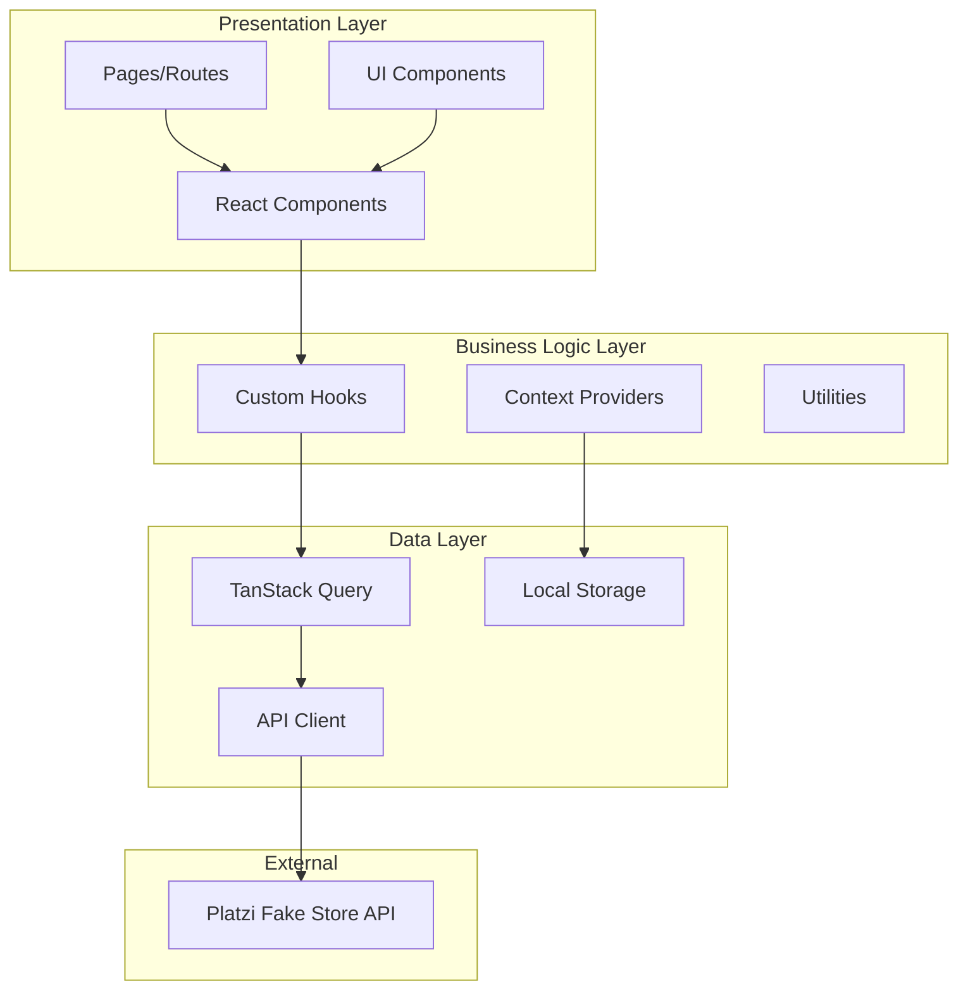

# Design Document

## Overview

The Platzi Fake Store application is a modern React-based product management system that demonstrates enterprise-level architecture patterns. The application follows a layered architecture with clear separation of concerns, implementing authentication, data caching, responsive UI, and advanced UX features.

### Key Design Principles

- **Component-based architecture** with reusable UI components
- **Separation of concerns** between data, business logic, and presentation
- **Performance-first** approach with code splitting and caching
- **Accessibility-first** design with WCAG compliance
- **Mobile-first** responsive design
- **Type safety** throughout the application with TypeScript

## Architecture

### High-Level Architecture



### Folder Structure

```
src/
├── components/           # Reusable UI components
│   ├── ui/              # Basic UI components (Button, Input, etc.)
│   ├── forms/           # Form components
│   ├── layout/          # Layout components (Header, Sidebar)
│   └── product/         # Product-specific components
├── pages/               # Route components (code-split)
│   ├── LoginPage.tsx
│   ├── ProductsPage.tsx
│   ├── CreateProductPage.tsx
│   ├── EditProductPage.tsx
│   ├── ProductDetailPage.tsx
│   └── NotFoundPage.tsx
├── hooks/               # Custom React hooks
│   ├── useAuth.ts
│   ├── useProducts.ts
│   ├── useCategories.ts
│   └── useLocalStorage.ts
├── services/            # API services and business logic
│   ├── api.ts           # Axios configuration
│   ├── auth.service.ts
│   └── products.service.ts
├── contexts/            # React contexts
│   ├── AuthContext.tsx
│   ├── ThemeContext.tsx
│   └── I18nContext.tsx
├── types/               # TypeScript type definitions
│   ├── api.types.ts
│   ├── product.types.ts
│   └── auth.types.ts
├── utils/               # Utility functions
│   ├── validation.ts
│   ├── formatting.ts
│   └── constants.ts
├── styles/              # Global styles and Tailwind config
└── __tests__/           # Test files
```

## Components and Interfaces

### Core Components

#### 1. Authentication System

**AuthContext**
```typescript
interface AuthContextType {
  user: User | null;
  token: string | null;
  login: (email: string, password: string) => Promise<void>;
  logout: () => void;
  isAuthenticated: boolean;
  isLoading: boolean;
}
```

**AuthGuard Component**
- Protects routes requiring authentication
- Redirects to login if not authenticated
- Shows loading state during token validation

#### 2. Product Management

**ProductTable Component**
- Responsive table/card layout
- Integrated search with debounced input
- Column sorting (title, price)
- Pagination controls
- Filter panels (category, price range)
- Action buttons (edit, delete)

**ProductForm Component**
- Shared form for create/edit operations
- Form validation with error display
- Image upload handling
- Category selection dropdown
- Optimistic UI updates

#### 3. Navigation System

**Router Configuration**
```typescript
const router = createBrowserRouter([
  {
    path: "/login",
    element: lazy(() => import("./pages/LoginPage")),
  },
  {
    path: "/",
    element: <AuthGuard />,
    children: [
      {
        index: true,
        element: lazy(() => import("./pages/ProductsPage")),
      },
      {
        path: "products/new",
        element: lazy(() => import("./pages/CreateProductPage")),
      },
      {
        path: "products/:id/edit",
        element: lazy(() => import("./pages/EditProductPage")),
      },
      {
        path: "products/:id",
        element: lazy(() => import("./pages/ProductDetailPage")),
      },
    ],
  },
  {
    path: "*",
    element: lazy(() => import("./pages/NotFoundPage")),
  },
]);
```

#### 4. Theme System (Extra)

**ThemeProvider**
```typescript
interface ThemeContextType {
  theme: 'light' | 'dark' | 'system';
  setTheme: (theme: 'light' | 'dark' | 'system') => void;
  resolvedTheme: 'light' | 'dark';
}
```

#### 5. Internationalization (Extra)

**I18nProvider**
```typescript
interface I18nContextType {
  locale: 'en' | 'pl';
  setLocale: (locale: 'en' | 'pl') => void;
  t: (key: string, params?: Record<string, any>) => string;
}
```

### Data Models

**Note:** Data models based on the Platzi Fake Store API (https://api.escuelajs.co/api/v1). These follow the typical structure for this API, but should be validated during implementation.

#### Product Model
```typescript
interface Product {
  id: number;
  title: string;
  price: number;
  description: string;
  images: string[];
  category: Category;
  creationAt: string;
  updatedAt: string;
}

interface CreateProductRequest {
  title: string;
  price: number;
  description: string;
  images: string[];
  categoryId: number;
}

interface UpdateProductRequest extends Partial<CreateProductRequest> {}
```

#### Category Model
```typescript
interface Category {
  id: number;
  name: string;
  image: string;
  creationAt: string;
  updatedAt: string;
}
```

#### Authentication Model
```typescript
interface LoginRequest {
  email: string;
  password: string;
}

interface LoginResponse {
  access_token: string;
  refresh_token: string;
}

interface User {
  id: number;
  email: string;
  name: string;
  role: string;
  avatar: string;
  creationAt: string;
  updatedAt: string;
}
```

#### API Filter Parameters (From requirements)
```typescript
interface ProductFilters {
  title?: string;
  price?: number;
  price_min?: number;
  price_max?: number;
  categoryId?: number;
  categorySlug?: string;
  limit?: number;
  offset?: number;
}
```

### API Integration

**API Documentation:** The Platzi Fake Store API documentation is available at https://fakeapi.platzi.com/en/rest/swagger, which shows the actual endpoints at https://api.escuelajs.co/api/v1.

#### API Client Configuration
```typescript
// Base axios configuration
const apiClient = axios.create({
  baseURL: 'https://api.escuelajs.co/api/v1',
  timeout: 10000,
});

// Request interceptor for auth tokens
apiClient.interceptors.request.use((config) => {
  const token = localStorage.getItem('auth_token');
  if (token) {
    config.headers.Authorization = `Bearer ${token}`;
  }
  return config;
});
```

#### TanStack Query Configuration
```typescript
const queryClient = new QueryClient({
  defaultOptions: {
    queries: {
      staleTime: 10 * 1000, // 10 seconds cache
      retry: 2,
      refetchOnWindowFocus: false,
    },
  },
});
```

## Data Flow

### Authentication Flow
1. User submits login form
2. API call to `/auth/login`
3. Store tokens in secure storage
4. Update auth context
5. Redirect to products page
6. Attach Bearer token to subsequent requests

### Product Management Flow
1. Load products with filters from URL params
2. Cache results with TanStack Query
3. User interactions update URL params
4. Optimistic updates for CRUD operations
5. Error handling with rollback on failure
6. Toast notifications for user feedback

### State Persistence Flow
1. URL params store filter/sort/pagination state
2. LocalStorage stores user preferences (theme, language, page size)
3. URL changes trigger data refetch
4. Browser navigation maintains state

## Error Handling

### Error Boundary Strategy
- Global error boundary for unhandled errors
- Route-level error boundaries for page-specific errors
- Component-level error handling for forms and data operations

### API Error Handling
```typescript
interface ApiError {
  message: string;
  statusCode: number;
  error: string;
}

// Error handling in queries
const useProducts = (filters: ProductFilters) => {
  return useQuery({
    queryKey: ['products', filters],
    queryFn: () => productsService.getProducts(filters),
    onError: (error: ApiError) => {
      toast.error(error.message || 'Failed to load products');
    },
  });
};
```

### Form Validation
- Client-side validation using Zod or similar
- Real-time validation feedback
- Server-side error display
- Accessibility-compliant error messages

## Testing Strategy

### Unit Testing
- Component testing with React Testing Library
- Hook testing with @testing-library/react-hooks
- Utility function testing with Jest
- Mock API responses for isolated testing

### Integration Testing
- Authentication flow testing
- Product CRUD operations
- Filter and search functionality
- Navigation and routing

### E2E Testing (Optional)
- Happy path user journeys
- Critical business flows
- Cross-browser compatibility

### Test Structure
```
src/__tests__/
├── components/
│   ├── ProductTable.test.tsx
│   ├── ProductForm.test.tsx
│   └── AuthGuard.test.tsx
├── hooks/
│   ├── useAuth.test.ts
│   └── useProducts.test.ts
├── services/
│   └── products.service.test.ts
└── utils/
    └── validation.test.ts
```

## Performance Optimizations

### Code Splitting
- Route-based code splitting with React.lazy
- Component-level splitting for large components
- Dynamic imports for heavy libraries

### Caching Strategy
- TanStack Query for server state caching (10s)
- LocalStorage for user preferences
- Browser cache for static assets
- Prefetching on navigation hover/focus

### Bundle Optimization
- Tree shaking for unused code
- Image optimization and lazy loading
- Font preloading
- Critical CSS inlining

### Runtime Performance
- React.memo for expensive components
- useMemo/useCallback for expensive computations
- Virtual scrolling for large lists (if needed)
- Debounced search inputs

## Accessibility Features

### Keyboard Navigation
- Tab order management
- Focus trapping in modals
- Skip links for main content
- Keyboard shortcuts (/, n, g+l)

### Screen Reader Support
- Semantic HTML structure
- ARIA labels and descriptions
- Live regions for dynamic content
- Proper heading hierarchy

### Visual Accessibility
- High contrast ratios (4.5:1 minimum)
- Focus indicators
- Color-blind friendly palette
- Scalable text and UI elements

## Security Considerations

### Authentication Security
- Secure token storage (httpOnly cookies preferred, localStorage as fallback)
- Token expiration handling
- Automatic logout on token expiry
- CSRF protection

### Data Validation
- Input sanitization
- XSS prevention
- API response validation
- File upload restrictions

### Network Security
- HTTPS enforcement
- Request timeout handling
- Rate limiting awareness
- Error message sanitization

## Responsive Design

### Breakpoint Strategy
```css
/* Tailwind breakpoints */
sm: 640px   /* Mobile landscape */
md: 768px   /* Tablet */
lg: 1024px  /* Desktop */
xl: 1280px  /* Large desktop */
```

### Mobile-First Approach
- Touch-friendly interface elements
- Swipe gestures for navigation
- Optimized table/card layouts
- Collapsible filter panels

### Layout Adaptations
- Responsive navigation (hamburger menu on mobile)
- Adaptive product grid/table
- Modal vs. full-page forms on mobile
- Flexible typography scaling

## Extra Features Implementation

### Dark/Light Theme
- CSS custom properties for theme variables
- System preference detection
- Smooth theme transitions
- Persistent theme storage

### Internationalization
- Translation key management
- Number and date formatting
- RTL language support preparation
- Dynamic locale switching

### Keyboard Shortcuts
- Global shortcut handler
- Context-aware shortcuts
- Visual shortcut indicators
- Accessibility compliance

This design provides a solid foundation for implementing a production-ready React application that meets all the specified requirements while maintaining high code quality, performance, and user experience standards.